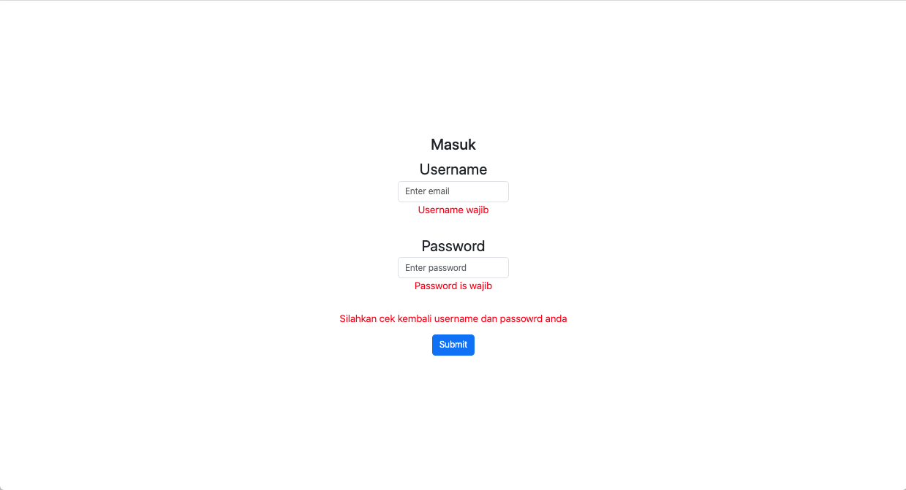
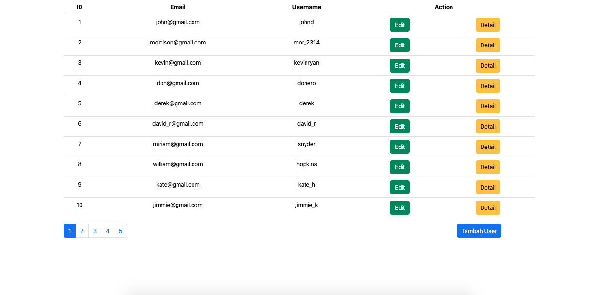
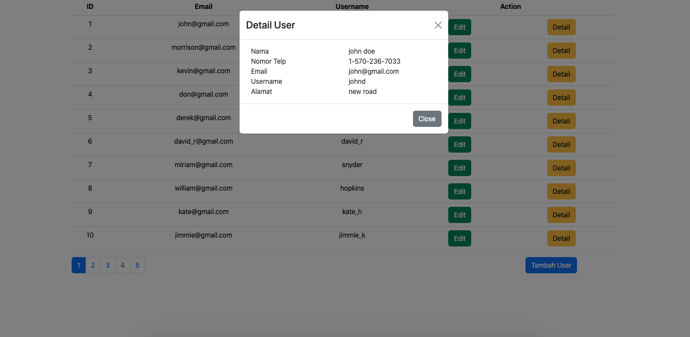
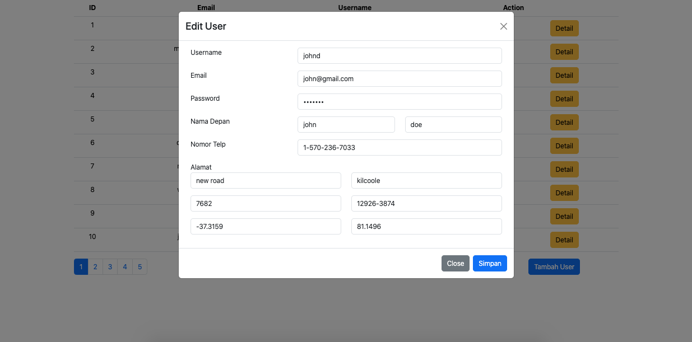
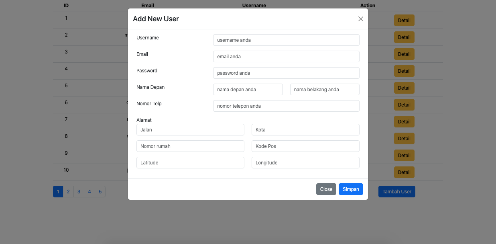

# Merkle-Task

Made with React JS

## How to run this project
```
git clone https://github.com/fandu139/merkle-task.git
npm run install
npm run start
```

Anda bisa menggunakan credential ini 
```
  username: "johnd",
  password: "m38rmF$"
```

## Requirement
- [X] Login Page
- [X] List User
- [X] Modal Show Detail User
- [X] Modal Show Edit User
- [X] Modal New User

## Structure

```
src
├── context
├── hook
├── utils
├── views
│   ├── Auth
│   ├── Users
│   │   │──── List
│   │   │   │──── components
│   │   │   │   ├─── Modal
│   │   │   │   │   ├─── AddUser
│   │   │   │   │   ├─── DetailUser
│   │   │   │   │   ├─── EditUser
```

## Reference
| Action name             | image                               |  Deskripsi                               |
| ----------------------- | ----------------------------------- | ----------------------------------- |
| Login Page |  | Halaman Login dan terdapat beberapa rule yang perlu di isi, seperti wajib fill email dan password |
| List User |  | Halaman daftar User dan menapilkan beberapa action, seperti tambah data, detail user dan edit user |
| Modal Show Detail User |  | Modal detail user |
| Modal Show Edit User |  | Modal edit user |
| Modal New User |  | Modal tambah user |
